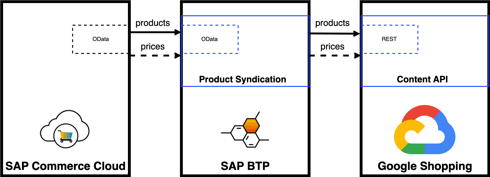

# What Is A Product Syndication?

Product Syndication for SAP Commerce Cloud is a multi-tenant SaaS solution by SAP that allows pushing product data from your store to Google Merchant Center.

Products pushed to Google Content API will be available in Google Shopping ads, Google Search or YouTube.

Product syndication can be set to be pushed regularly as a whole bulk upload or include just recently modified products.

The following graphic shows simplified solution architecture:

Communication goes in one direction. Commerce Cloud sends required product data to Product Syndication using built-in Integration Services.

Product Syndication validates sent data, transforms it to Google Content API compatible format, and sends it asynchronously to Google.

Google consumes data. In case of errors, these are logged and available to review in Product Syndication logs.

SAP Commerce Cloud can optionally send just product prices through supplemental feed if needed, e.g. if prices are updated daily.

## Getting Started

Product Syndication allows you to automate product data export to Google Merchant Center. 

Key features provided by our solution are:

- Upload products
- Update product prices and availability
- Partial update for recently modified products
- Link inventory to Google Ads
- Pre-configured product attribute mapping to Google requirements
- Built-in product data validation 
- Supported Commerce Multi-country, multi-store strategies
- Supported all SAP Commerce Cloud standard product types
- Product export reporting
- Configuration auditing

## Requirements

To successfully configure and run Product Syndication you must meet the list of requirements.

### Google Merchant Center

To use our solution, you need to make sure that on the Google side you have completed a few steps:

- Have a [Google Merchant Center](https://support.google.com/merchants/topic/7294166?hl=en&amp;ref_topic=7259125,7259405,) account created
- Have [Google Service Account](https://developers.google.com/shopping-content/guides/how-tos/service-accounts) created for Content API for Shopping
- Add [shipping options](https://support.google.com/merchants/answer/6069284?hl=en) on Google Merchant Center
- If you sell in the US, [tax information](https://support.google.com/merchants/answer/160162?hl=en&amp;ref_topic=7294266&amp;sjid=14602634772741637750-EU) must be configured on the Google side too

> **Note**
> 
> Google Merchant Center availability is limited to a list of countries. The full list of countries is available on the Google Merchant [Supported Languages and Currencies](https://support.google.com/merchants/answer/160637#zippy=%2Ctarget-country-currency-local-language%2Ctarget-country-currency-supported-language) page.