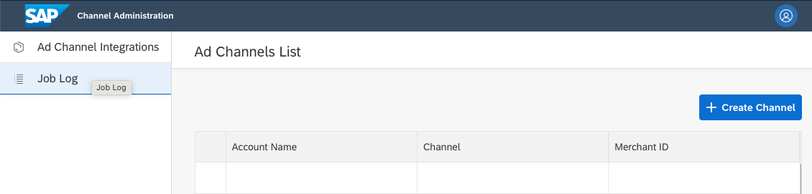
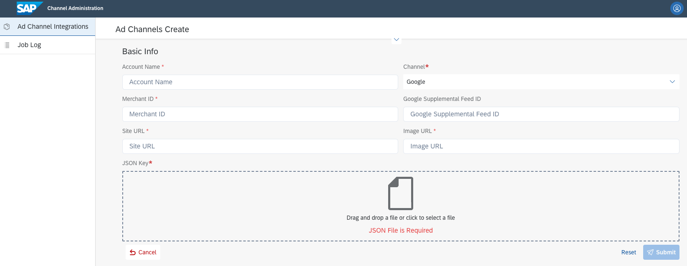
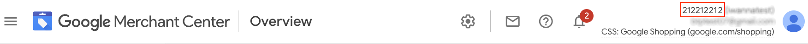
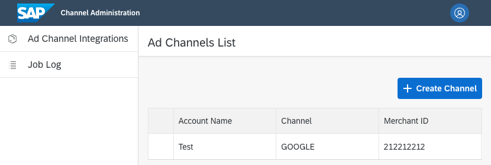

# Initial Configuration

## Set Up Google Merchant Account

Google Merchant account must have a few sections completed to continue with Product Syndication. The list has been mentioned in the [Google Merchant Requirements](./0-what-is-product-syndication.md#) section.

[Google Merchant Center](https://support.google.com/merchants/topic/7294166?hl=en&amp;ref_topic=7259125,7259405,) support page will guide you through the essential steps required to have your account properly configured for running ad campaigns.

You will learn:

 - how to sign up for Google Merchant Center,
 - set up store name, logo and contact details,
 - claim online website as yours,
 - set up email notifications in case of product validation errors.
 
 Google also shares a knowledge base about <a href="https://support.google.com/merchants/answer/6363310?hl=en&amp;ref_topic=3163841&amp;sjid=3840552233369493276-EU">Google Merchant guidelines</a> to follow.
 
 Product Syndication uses Google Content API to push product data. For that, it is required to have <a href="https://developers.google.com/shopping-content/guides/how-tos/service-accounts">Google Service Account</a> created. Google click-through video tutorial on <a href="https://www.youtube.com/watch?v=tSnzoW4RlaQ">Creating and Using Service Accounts</a>. Keep in mind to When you do that, create a JSON private key, and temporarily download it on the local disk. You will need that later to configure the Product Syndication channel.

> **Keep it safe**
> 
> JSON private key is like a plain text password. It must not be shared or published to a third party. You should use it just for configuring access to your Service Account and then delete it securely.

## Configuring Shipping and Taxes

Open <a href="https://merchants.google.com/">Google Merchant Center</a> and complete the section about <a href="https://support.google.com/merchants/answer/6069284?hl=en">shipping costs</a> in your store.

If you sell goods to the US, you are obliged to <a href="https://support.google.com/merchants/answer/160162?hl=en&amp;ref_topic=7294266&amp;sjid=14602634772741637750-EU">set up tax information</a> in your account.

## Need Help Setting Up Google Account?
Google provides a detailed <a href="https://support.google.com/merchants/answer/188924?hl=en&amp;visit_id=638048092133601424-1029073165&amp;ref_topic=3163841&amp;rd=1">Help Center</a> where you can find all information related to Merchant Center.

# Configure Google Account in Channel Administration
When a Google Merchant Center service account is created, we can connect Product Syndication with Google. Visit your Product Syndication URL and follow the steps below.

## Set Up Ad Channel Account
Log in to your Channel Administration cockpit.

Click on "**Ad Channel Integrations**" to see the "**Ad Channels List**" page. Then click on "**Create Channel**" in the top right corner.

Fill in your webshop and Google account details.

<table><colgroup><col><col><col></colgroup><thead><tr><th>Field</th><th>Required</th><th>Description</th></tr></thead><tbody><tr><td>Account Name</td><td>YES</td><td>Your personalised account ID name.</td></tr><tr><td>Channel</td><td>YES</td><td>Integration channel used. Currently, GOOGLE is available only.</td></tr><tr><td>Merchant ID</td><td>YES</td><td>Google Merchant Account ID. That numeric ID is visible in the top right corner of your Google Merchant Center page

</td></tr><tr><td>Google Supplemental Feed ID</td><td>NO</td><td>Optional supplemental product feed for attributes which may change frequently e.g. price or availability.

</td></tr><tr><td>Site URL</td><td>YES</td><td>Your domain name, which is a base URL for product pages. Commerce Cloud generates relative URLs which is why Product Syndication has to know what domain has to be prepended to product URLs.

Value has to be a valid URL and start from "**https://**".

</td></tr><tr><td>Image URL</td><td>YES</td><td>Your domain name for image hosting. In most cases, it will be the same as Site URL, but if you use an external CDN you will need to configure the right one.

Value has to be a valid URL and start from "**https://**".

</td></tr><tr><td>JSON Key</td><td>YES</td><td>Generated JSON private key for your Google Service Account

</td></tr></tbody></table>JSON file can be dragged and dropped on the form. After submission, you can delete the file from your local disk.

The credentials provided, which are **Merchant ID** and **JSON key,** will be verified on saving. In case of an error, the user will see an error message.

After successful submission, you will see a list of configured ad channels.

## When To Use Multiple Google Shopping Accounts?

Product Syndication allows you to configure multiple accounts. That feature allows you to meet requirements related to possible Commerce Cloud configuration strategies.

### Multiple Brands and Separate Domains

When your instance hosts multiple separate brands e.g. **https://premium-electronics.com** and **https://wholesale-electronics.com**. Even when you have the same prices you may have a situation where on one website you sell just a subset of products and only these should be pushed to Google.

 - Create a separate merchant account for **https://premium-electronics.com**, claim that shop domain, create Service Account for it and add it as Ad Channel in Product Syndication
 - Create a separate merchant account for **https://wholesale-electronics.com**, claim that shop domain, create Service Account for it and add it as Ad Channel in Product Syndication
 
 ### Multiple countries With Product Separation

If your shop supports multiple countries with any product separation i.e. different product availability, stock levels, or prices it is recommended to separate the product feed on Google Merchant.

In case when you have **https://premium-electronics.de** and **https://premium-electronics.fr.** Each shop has a separate pricing strategy and a local warehouse where goods are delivered. All data stay in Commerce Cloud but have to be split not to mix e.g. product availability, prices, or different product description.

 - Create a separate merchant account for **https://premium-electronics.de,** claim that shop domain, create Service Account for it and add it as Ad Channel in Product Syndication
 - Create a separate merchant account for **https://premium-electronics.fr, **claim that shop domain, create Service Account for it and add it as Ad Channel in Product Syndication
